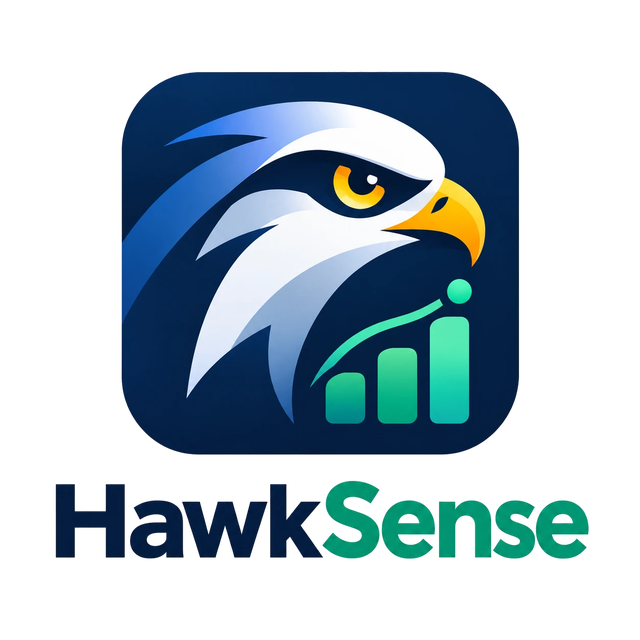

<h1 align="center">
  <picture>
    <source media="(prefers-color-scheme: dark)" srcset="assets/hawksense-logo-dark.png">
    
  </picture>
</h1>

<p align="center"><b>Smart price tracker: the real delivered price, and whether to buy now or wait.</b></p>

A smart price tracker for Israeli shoppers (and anyone else). It tracks one item across
several online stores, local or worldwide, and compares the **real delivered price**:
shipping, customs duty, VAT and courier fees included. It then tells you whether to
**buy now or wait** for an upcoming sales day, with a confidence score.

- **Multi-store tracking**: KSP, Ivory, Bug, LastPrice, Payngo, ACE, Zap, Amazon (US/UK/DE),
  AliExpress, eBay (US/UK/DE), B&H, Newegg. Any other shop works too, with country and currency
  guessed from the domain.
- **eBay**: track a single listing, or a *search* that follows the cheapest matching
  buy-it-now listing (price + shipping). Uses eBay's official API when you add keys.
- **Package forwarders**: Dealtas, RedBox, Zipy, MyUS, Shipito, Stackry, Planet Express and
  Forward2me. Add the addresses they gave you (US, UK, ...) and every store abroad is also
  priced through them, each by its own rules: weight-based rates, volumetric weight, handling,
  insurance and service fees, US sales tax at the warehouse's state, and who pays import tax.
- **Weight and size from the store pages**, cross-checked between stores, with an alert
  when they're missing or disagree.
- **Rules that stay current**: taxes and forwarder rates are checked for updates
  automatically, odd changes wait for your OK, and you can change any of them by hand.
- **Notifications** by email, Telegram, WhatsApp, ntfy push, webhook or in the app, for the
  events you pick: buy now, target reached, price drops, upcoming sales, rule changes, and more.
- **Landed cost**: Israeli import rules by default: 18% VAT above the personal-import
  exemption, customs duty per category above $500, and a courier clearance fee when taxes
  are collected on arrival. Stores that charge VAT at checkout (Amazon, AliExpress) are
  handled. US, EU and UK destination profiles are also included.
- **Sales-day calendar**: Black Friday/Cyber Monday, 11.11, Prime Day, Prime Big Deal Days,
  AliExpress Anniversary, 618, Boxing Day, Back to School, and the Israeli pre-Rosh Hashana
  and pre-Passover sales, computed from the Hebrew calendar.
- **Buy/wait advice with confidence**: a Monte-Carlo model that combines the item's price
  trend and volatility with how likely each upcoming event is to discount it, and by how
  much. It learns from the item's own behaviour in past events.
- **Web app / iOS PWA** that works fully offline and syncs changes when you're back online.
- No dependencies. Python 3.11+ and SQLite.

> HawkSense was previously called HawkDrop. Old `HAWKDROP_*` environment variables and an
> existing `~/.hawkdrop` data folder keep working.

## Install

```bash
pip install .          # or run in place: python -m hawksense ...
```

## Quick start

```bash
hawksense demo                     # a demo item with 14 months of synthetic history

hawksense track "Sony WH-1000XM5" --category electronics --target 1100 \
    --url https://ksp.co.il/web/item/XXXX \
    --url https://www.amazon.com/dp/XXXX \
    --url https://www.aliexpress.com/item/XXXX.html

hawksense check                    # fetch prices now (put it in cron: 0 */6 * * * hawksense check)
hawksense compare "WH-1000XM5"     # landed-cost table
hawksense advise  "WH-1000XM5"     # buy now or wait?
hawksense history "WH-1000XM5"     # sparkline of the best landed price
hawksense events --region IL       # upcoming sales days
```

Some sites block bots (captcha) or have no machine-readable price. You can either:

```bash
hawksense price "WH-1000XM5" ivory 1449 --shipping 29       # record a price manually
hawksense add-offer "WH-1000XM5" https://shop.co.il/p/1 --regex 'class="price">([\d,.]+)'
```

`--shipping` on `add-offer` or `price` overrides a store's shipping policy. Unknown shipping is
flagged with `?` in `compare`.

## eBay

```bash
hawksense add-offer "WH-1000XM5" https://www.ebay.com/itm/123456789012     # one listing
hawksense add-offer "WH-1000XM5" --ebay-search "sony wh-1000xm5" --condition new   # cheapest match
hawksense add-offer "WH-1000XM5" --ebay-search "sony wh-1000xm5" --ebay-site ebay.de
```

A search re-runs on every `check` and records the cheapest buy-it-now listing, counting its
shipping. `check` prints which listing it was. You can also paste any eBay search URL.

Without API keys HawkSense reads the public pages, which eBay sometimes blocks. For reliable
prices, and shipping costs quoted **to your country**, create a free developer account at
[developer.ebay.com](https://developer.ebay.com), make a production keyset, and add:

```toml
[ebay]
client_id = "YourApp-PRD-..."
client_secret = "PRD-..."
```

(or set `HAWKSENSE_EBAY_CLIENT_ID` / `HAWKSENSE_EBAY_CLIENT_SECRET`).

## Package forwarders

Many stores don't ship to Israel, or charge a lot for it. With a package forwarder you get a
personal address at its warehouse abroad, the store ships there, and the forwarder sends it
on. HawkSense prices every foreign store both ways, direct and through each forwarder you've
set up, and uses the cheapest.

```bash
hawksense forwarders                    # services, their warehouses, fees and rates
hawksense forwarder add dealtas         # asks for the address it gave you
hawksense forwarder add redbox          # asks for each warehouse: US, EU (skip what you don't use)
hawksense forwarder add zipy            # buy-for-me service: no address needed
hawksense forwarder add shipito --warehouse US --address "Your Name, 1 Rd #123, Portland, OR 97230"

hawksense track "WH-1000XM5" --weight 0.9 --dims 26x22x9   # improves shipping estimates
hawksense compare "WH-1000XM5" --routes    # every route, itemised
hawksense compare "WH-1000XM5" --explore   # also price services you haven't set up
```

| Service | Warehouses | Notable rules |
|---|---|---|
| Dealtas | US (Boston, MA) | published price table (Special Air: $25 up to 0.5 kg, $32 for 1 kg, $49 for 2 kg); MA sales tax 6.25%; volumetric (cm³/5000) only above 43×30×10 cm; one price, taxes collected up front on a declared $5/kg freight |
| RedBox | US (Edison, NJ), EU (Netherlands) | published price table per 100 g (US: $15 up to 250 g, $21 for 1 kg); NJ sales tax; max 20 kg; taxes paid through RedBox |
| Zipy | US, UK, DE, CN | buys for you (no address); service fee on the order; taxes included |
| MyUS | US (Florida) | 7% FL sales tax; rates from $9.99, Premium $9.99/month; courier collects taxes |
| Shipito | US (Oregon), US-CA (California) | cheapest carrier quote to Israel from its calculator ($31.53 up to 250 g, $63.03 for 1 kg); $3.25 handling ($2.25 Premium); tax-free Oregon needs Premium |
| Stackry | US (New Hampshire) | no sales tax; $1–2 receiving, $3 consolidation |
| Planet Express | US (California) | CA sales tax; $2 handling, consolidation $5 + $2/package |
| Forward2me | UK | UK prices include 20% VAT |

How a forwarded price is built:

1. the store price, plus the store's **domestic shipping** to the warehouse (for example
   Amazon.com is free over $35; override with `add-offer --local-shipping`),
2. **US sales tax** for the warehouse's state. HawkSense reads the state from your address,
   so `..., New Castle, DE 19720` means 0%. Override with `--sales-tax`,
3. the forwarder's **rate card**: price for the first weight step plus each extra step,
   charged on the greater of actual and volumetric weight (L×W×H / 5000). The weight and size
   come from the store pages (see [Weight and size](#weight-and-size)) or from you. If neither
   is known, a typical weight for the item's category is assumed and flagged,
4. **handling, insurance and service fees** as the service charges them,
5. **Israeli import tax** on goods + shipping, with the same exemptions as direct orders, plus
   the state's computer and security fees on taxed parcels (21 ILS over $100, 70 ILS over $500,
   91 ILS over $1000).
   It's paid either through the service (plus its fee) or to the courier (plus its clearance fee).

`compare` shows which address to ship the order to. In the web app, add forwarders under
**Settings → Package forwarders** (works offline too), and set weight and box size in an
item's edit sheet.

> Values checked against each service's published terms (September 2026) are marked ✓ in
> `hawksense forwarders` and in the app; everything else, including most per-kilo rates, is an
> estimate. Prices change often: check each service's price list and override them in the app
> (Settings → Taxes & forwarder rates) or in config.toml (see below). Stores that aren't
> built in are assumed to ship to you directly unless you set `ships_abroad = false`.

## Weight and size

Forwarders charge by weight, so every `check` also reads the weight and size from each store
page. It looks at structured product data, spec tables ("Item Weight", "Package Dimensions")
and Hebrew spec lists ("משקל", "מידות"), in g/kg/lb/oz and cm/mm/inches. Then it groups the
pages whose values agree (weights within 15%, box volumes within 30%):

| Result | Meaning | What HawkSense does |
|---|---|---|
| verified | every page that lists it agrees | uses it |
| unverified | only one page had it | uses it, marked as unverified |
| majority | one group of pages is bigger than the others | uses the bigger group's value and **asks you to confirm** |
| conflict | the biggest groups are the same size (e.g. 1 page vs 1 page) | uses **nothing**, **alerts you**, and puts forwarder prices **on hold** |
| missing | no page had a weight | uses **nothing**, **alerts you**, and puts forwarder prices **on hold** |

A value that's used while other pages disagree or don't list it is flagged for you to confirm,
with what each page said, for example:

> Weight 1.025 kg: Amazon (1 kg boxed) and B&H (1.05 kg boxed) agree, but KSP (2.5 kg boxed)
> differs; Bug doesn't list a weight.

"On hold" means forwarder routes for that item get no price, aren't picked as the best
option and send no price alerts until you set the weight and size. Buying directly from a
store doesn't depend on the weight, so those prices keep working.

Boxed (package/shipping) weights beat product weights. With only a product weight, ~10% plus
0.1 kg is added for the box. A value you set or confirm yourself is never overwritten.

```bash
hawksense specs "WH-1000XM5"                                   # what each page said, and the result
hawksense specs "WH-1000XM5" --confirm                         # the values shown are right: keep them
hawksense specs "WH-1000XM5" --source https://maker.example/wh-1000xm5   # cross-check another page
hawksense track "WH-1000XM5" --weight 1.1 --dims 26x22x9       # set it yourself
```

`check` prints a ⚠ line when the size is missing or split, and a ? line with what to confirm.
The `specs_alert` notification tells you too, once per set of values. In the web app, the
item page's **Weight & size** card shows what each page said, what to confirm (with a
**Looks right** button), or why forwarder prices are on hold.

## Keeping taxes and forwarder rates current

Tax rules and price lists change, so HawkSense checks for updates:

- **The rules feed.** [`rules/rules.json`](rules/rules.json) in this repository holds the
  current customs rules and forwarder rates. `hawksense serve` checks it every 7 days
  (`--rules-every DAYS`, 0 = never); `hawksense rules check` checks it now. Update that file
  when rules change, and every install picks it up. Point `[rules] feed_url` at your own
  copy, or set it to `""` to turn the feed off.
- **Page sources** you add: an official customs page or a forwarder's price page, read with
  a regex (one number) or as a weight/price table:

```toml
[rules.sources.il_exemption]
url = "https://..."                       # the page with the current exemption
target = "destination.IL.vat_exempt_usd"
regex = 'up to \$\s*(\d+)'               # first group = the value

[rules.sources.dealtas_rates]
url = "https://..."                       # a page with a weight/price table
target = "forwarders.dealtas.warehouses.US"
format = "table"                          # sets the whole price table, plus first, first_kg, step_kg, additional
```

Every fetched value is checked for range before use. A value that moves more than 50% (for a
price table: at any weight both tables list) is held for review, and you're notified (`rules_review`). Applied changes are also notified
(`rules_changed`).

```bash
hawksense rules show                 # values that differ from built-in, and where each comes from
hawksense rules show IL --all        # every Israeli customs value
hawksense rules check                # check the feed and sources now
hawksense rules pending              # changes waiting for you
hawksense rules accept 12            # (or reject 12)
hawksense rules set IL.vat_exempt_usd 150       # manual update
hawksense rules set IL.duty_rates.clothing 12%
hawksense rules set dealtas.US.first 12.5       # forwarder rate (warehouse currency)
hawksense rules unset IL.vat_exempt_usd
hawksense rules history
```

Precedence, lowest to highest: built-in, fetched, `config.toml`, manual. In the web app,
**Settings → Taxes & forwarder rates** edits the same values (also offline), shows where
each comes from, and lists changes to review.

## Notifications

Pick which events you want, and where each one goes:

| Event | When |
|---|---|
| `buy_now` | an item's advice changes to buy now |
| `target_hit` | the best delivered price reaches your target |
| `price_drop` | the best delivered price drops by 5% or more (`price_drop_pct`) |
| `sale_soon` | a sales day for your items' stores starts within 3 days (`sale_soon_days`) |
| `rules_changed` | taxes or forwarder rates were updated automatically |
| `rules_review` | a fetched change looks odd and needs your OK |
| `specs_alert` | an item's weight/size is missing, the store pages split evenly, or values need your confirmation |
| `check_failed` | a store's price couldn't be read 3 times in a row (`check_failed_after`) |

Set channels up in the app (**Settings → Notifications → Channels**, with a test button) or in
`config.toml`. Secrets can also come from environment variables,
named `HAWKSENSE_<CHANNEL>_<FIELD>`, e.g. `HAWKSENSE_TELEGRAM_BOT_TOKEN` or
`HAWKSENSE_EMAIL_PASSWORD`.

```toml
[notify]
app_url = "https://hawksense.example.com"    # adds links to messages (optional)

[notify.telegram]        # talk to @BotFather to create a bot, send it a message,
bot_token = "123:ABC"    # then read chat_id from https://api.telegram.org/bot<token>/getUpdates
chat_id = "123456789"

[notify.whatsapp]        # free: CallMeBot (get a key: https://www.callmebot.com/blog/free-api-whatsapp-messages/)
provider = "callmebot"
phone = "+972501234567"
apikey = "123456"
# or Twilio: provider = "twilio", account_sid, auth_token, sender = "+1415...", to = "+9725..."

[notify.email]
host = "smtp.gmail.com"  # Gmail needs an app password
port = 587               # 465 = SSL
username = "me@gmail.com"
password = "app-password"
to = "me@gmail.com"      # sender defaults to username

[notify.ntfy]            # free push notifications to the ntfy app (iOS/Android/desktop)
topic = "hawksense-pick-a-long-secret-name"
# server = "https://ntfy.sh", token = "..." for a private server

[notify.webhook]         # anything else: Slack/Discord-compatible bridges, Home Assistant, n8n ...
url = "https://..."
```

```bash
hawksense notify                                  # channels, and which events go where
hawksense notify subscribe buy_now inbox telegram whatsapp
hawksense notify subscribe all inbox ntfy         # every event
hawksense notify subscribe sale_soon              # no channels = off
hawksense notify set price_drop_pct 8
hawksense notify test telegram
hawksense notify inbox                            # read in the terminal
```

Events are raised after every price check (`check`, the server's scheduled checks, or
**Check** in the app) and every rules check. Each event is sent once, not repeated at the
next check. By default events only go to the in-app inbox; you opt in to each channel. You
can mute a single item in its edit sheet.

In the web app: a bell in the header shows unread notifications, and **Settings →
Notifications** has the event × channel grid, test buttons and **Alerts on this device**.
That shows system notifications on your phone or computer while HawkSense is open or
recently used. When the app is fully closed, use Telegram, WhatsApp, ntfy or email: web push
would need extra dependencies.

## Example advice

```
  Recommendation : WAIT until Nov 23 (Black Friday / Cyber Monday)
  Confidence     : 80% (high)
  Best offer now : AliExpress - 1,307 ILS delivered
  Expected price : ~1,169 ILS  (80% range 1,046 ILS - 1,305 ILS)

  Why:
   • Watch through Amazon Prime Big Deal Days (October), Singles' Day 11.11, Black Friday /
     Cyber Monday (...): 83% chance one of them beats today's price by more than the cost
     of waiting; expected net saving ~106 ILS.
   • Buy at the first sale where the landed price drops below: 1,253 ILS (...), 1,232 ILS
     (Singles' Day 11.11), 1,221 ILS (Black Friday / Cyber Monday).
   • This item dropped in 1/1 past Black Friday / Cyber Monday events.
```

## Web app and iPhone app (PWA)

```bash
hawksense serve                                    # http://localhost:8765
hawksense serve --host 0.0.0.0 --token MYSECRET --check-every 6   # reachable from your phone
```

To run it permanently on a home server, NAS or VPS, see [Self-hosting](#self-hosting).

The web client lets you see your items (each with its picture, read automatically from the
store pages), the buy/wait advice with its confidence, a price chart with past sales shaded,
the delivered-price breakdown for each store, and the sales calendar. From it you can log
prices, add stores and track new items. A search box on the items list finds one by name,
category or store once you're tracking a handful. When you add an item, "Search all stores"
adds a search offer at every store that supports one (Amazon, AliExpress, Newegg, eBay) so
its own next check fills in prices without you hunting for links; and every store's "Other
ways to get it" lists every forwarder that could ship it, not just the ones you've already
set up, with a one-tap "Set up this forwarder" for the rest.

**Offline.** The app is offline-first:

- A service worker caches the app itself, so it opens with no connection.
- The last data synced from the server is stored on the device (IndexedDB).
- While offline you can browse everything, **log prices, add stores, track new items, edit
  or delete them**. Changes wait in a queue ("2 pending") and are sent when the server is
  reachable again. Each queued price carries a unique ID, so a retry never records it twice.
- Only fetching prices from store websites ("Check") and loading the demo need a connection.

**Installing on iPhone / iPad:**

1. Run the server where your phone can reach it (see [Self-hosting](#self-hosting)), **over HTTPS**. iOS only enables service
   workers (offline mode) on HTTPS or `localhost`. Some easy ways:
   - [Tailscale](https://tailscale.com/kb/1312/serve): `tailscale serve 8765` gives you
     `https://<machine>.<tailnet>.ts.net`;
   - a Cloudflare Tunnel;
   - your own certificate: `hawksense serve --host 0.0.0.0 --cert cert.pem --key key.pem`.
     [mkcert](https://github.com/FiloSottile/mkcert) works, but you need to install its root
     CA on the iPhone.
2. Open the URL in **Safari** (add `?token=…` if you started the server with `--token`).
3. Tap **Share → Add to Home Screen**. The home-screen app keeps the token.
4. Open the app once while online. After that it works offline and syncs when it opens,
   when it returns to the foreground and when the connection comes back. iOS has no
   background sync, so syncing only happens while the app is open.

`--check-every HOURS` makes the server fetch every tracked store page on a schedule, so
prices keep updating while your phone is offline.

## Self-hosting

HawkSense is a single process with a SQLite file. It needs no external database or
services and runs well on a Raspberry Pi, a NAS or a small VPS.

### Docker Compose (recommended)

```bash
git clone https://github.com/de-Bat/HawkSense && cd HawkSense
cp .env.example .env            # set HAWKSENSE_TOKEN (openssl rand -hex 24)
docker compose up -d            # http://<server>:8765/?token=<token>
```

For the iPhone app you need HTTPS. If you have a domain pointing at the server (ports 80
and 443 open), set `HAWKSENSE_DOMAIN` in `.env` and start the bundled Caddy, which gets and
renews a Let's Encrypt certificate automatically:

```bash
docker compose --profile https up -d   # https://<HAWKSENSE_DOMAIN>/?token=<token>
```

Useful commands:

```bash
docker compose logs -f hawksense                          # logs (incl. scheduled checks)
docker compose exec hawksense hawksense check              # fetch prices now
docker compose exec hawksense hawksense backup /data/backups   # consistent backup, safe while running
                                                          # (also keep /data/secret.key, see Security notes)
docker compose pull && docker compose up -d --build      # update
```

The image runs as a non-root user and needs no network access to build, since there are no
dependencies. It stores everything in the `/data` volume, reports its status through
Docker's `HEALTHCHECK`, and shuts down cleanly on `docker stop`. Put a `config.toml` in
`/data` (or mount one) for tax, advisor and store overrides.

Plain Docker works too:

```bash
docker build -t hawksense .
docker run -d --name hawksense -p 8765:8765 -v hawksense-data:/data \
  -e HAWKSENSE_TOKEN=change-me -e HAWKSENSE_CHECK_EVERY=6 --restart unless-stopped hawksense
```

### HTTPS without a public domain

- **Tailscale** (easiest): install it on the server and your phone, then
  `tailscale serve --bg 8765` gives `https://<server>.<tailnet>.ts.net` with a real
  certificate, reachable only from your devices.
- **Caddy with an internal CA**: use the `tls internal` block in `deploy/Caddyfile`, then
  install Caddy's root certificate on the iPhone and enable it under Settings → General →
  About → Certificate Trust Settings.
- **Cloudflare Tunnel**: point a tunnel at `http://hawksense:8765`.

### Behind your own reverse proxy / on a sub-path

The web app uses only relative URLs, so it works at the root of a domain or under a path
like `https://home.example.com/hawksense/`:

- if the proxy **strips** the prefix (Caddy `handle_path`, nginx `location /hawksense/ {
  proxy_pass http://127.0.0.1:8765/; }`), nothing else is needed;
- if it forwards the path unchanged, set `HAWKSENSE_BASE_PATH=/hawksense`.

When a proxy is in front, set `HAWKSENSE_BIND=127.0.0.1` in `.env` so port 8765 isn't
exposed directly.

### Without Docker (systemd)

```bash
sudo python3 -m venv /opt/hawksense && sudo /opt/hawksense/bin/pip install .
sudo cp deploy/hawksense.service /etc/systemd/system/
echo "HAWKSENSE_TOKEN=$(openssl rand -hex 24)" | sudo tee /etc/hawksense.env && sudo chmod 600 /etc/hawksense.env
sudo systemctl enable --now hawksense     # data in /var/lib/hawksense, logs: journalctl -u hawksense
```

### Server settings

Each setting can be a CLI flag, an environment variable or a `[server]` entry in
`config.toml`. When the same setting is given more than once, the CLI flag wins over the
environment variable, which wins over the config file.

| Flag | Environment | Default | |
|---|---|---|---|
| `--host` | `HAWKSENSE_HOST` | `127.0.0.1` | `0.0.0.0` (or `::`) to listen on the network |
| `--port` | `HAWKSENSE_PORT` | `8765` | |
| `--token` / `--token-file` | `HAWKSENSE_TOKEN` / `HAWKSENSE_TOKEN_FILE` | none | access token (file: e.g. Docker secret) |
| `--check-every` | `HAWKSENSE_CHECK_EVERY` | off | hours between automatic price checks; the schedule survives restarts |
| `--cert` / `--key` | `HAWKSENSE_CERT` / `HAWKSENSE_KEY` | none | serve HTTPS directly |
| `--base-path` | `HAWKSENSE_BASE_PATH` | none | URL prefix if the proxy doesn't strip it |
| `--rules-every` | `HAWKSENSE_RULES_EVERY` | `7` | days between automatic rules checks (0 = off) |

`--check-every` and `--rules-every` are only starting values. An interval set in the app
(**Settings → Automatic checks**) replaces them without a restart.
| `--db` | `HAWKSENSE_DB` | `$HAWKSENSE_HOME/hawksense.db` | |
| `--dest` | `HAWKSENSE_DEST` | `IL` | destination country for taxes |
| | `HAWKSENSE_HOME` | `~/.hawksense` | data + `config.toml` directory |
| | `HAWKSENSE_CONFIG` | `$HAWKSENSE_HOME/config.toml` | |

Security notes:

- `/api/health` is the only endpoint that works without the token.
- Tokens are compared in constant time, and more than 20 wrong tokens a minute from one
  address get "try again later". Tokens are redacted from the server log (the app URL can
  carry `?token=`).
- **Other websites can't drive your HawkSense**, even without a token. The API only accepts
  JSON requests, and refuses requests the browser marks as coming from another site. A web
  page you visit can't add items, change rules or change settings behind your back.
- **DNS rebinding is blocked on servers without a token.** They only answer to IP addresses,
  `localhost` and local network names (`*.local`, `*.lan`, `*.home.arpa`, single-word names
  like `nas`). To reach a token-less server under another name, list it in
  `HAWKSENSE_ALLOWED_HOSTS` (comma-separated), or better, set a token; with a token any host
  name works.
- Product links must be `http`/`https`, so a `javascript:` link can't be planted in the app.
- Pages are sent with a strict Content-Security-Policy and `Referrer-Policy: no-referrer`,
  so the token in the app URL never leaks to store sites.
- The server logs a warning if it is reachable from the network without a token.
- Internal errors are logged on the server; the API only says that one happened. The database
  and backups are readable by their owner only.
- Pages from store sites are parsed in linear time, so a hostile page can't tie up the server.
- **Outbound fetches are limited to the public internet.** Product links, spec pages, rule
  sources and the rules feed can only be `http`/`https` addresses. Anything that points to
  your own network, the machine itself or a cloud metadata service (127.0.0.1, 192.168.x,
  10.x, 169.254.169.254, ...) is refused. This is checked before connecting, on every
  redirect, and against the address actually connected to. Downloads stop at 8 MB. To track
  a shop on your own network, set `HAWKSENSE_ALLOW_PRIVATE_FETCH=1`. Notification webhooks
  and a self-hosted ntfy may point at your network on purpose, so they're not limited.
- **Passwords, tokens and API keys saved in the app are encrypted** in the database, with a
  key kept outside it: `secret.key` next to the database (created on first use, readable only
  by its owner). You can supply the key yourself with `HAWKSENSE_SECRET_KEY` or
  `HAWKSENSE_SECRET_KEY_FILE` (e.g. a Docker secret). A copied database or a `hawksense backup`
  file doesn't reveal them. Keep a copy of the key with your backups, or enter the secrets
  again after a restore; the app marks any it can't decrypt. Secrets in `config.toml` or
  environment variables are yours to protect, e.g. with `chmod 600` or Docker secrets.

## How the advice works

1. **Daily best price.** Each day, the cheapest in-stock landed price across all stores. A
   store's last reading counts for up to 14 days.
2. **Trend and noise.** Log-linear regression over the last 90 days, damped and capped so a
   short slide is not extrapolated too far.
3. **Events.** For every sales event in the next 75 days that one of the item's stores takes
   part in, HawkSense starts from a category prior: P(item discounted), and the typical
   discount depth. It then updates that prior with what this item did in past occurrences of
   the event: the drop against the median of the 35 days before it.
4. **Simulation.** 4,000 correlated price paths. The events share a price-level random walk
   and a "this item gets promoted" propensity. The strategy "watch through events 1..k and
   buy at the first one below the trigger price" is scored by its expected saving *net of
   waiting cost*. The waiting cost (0.06%/day by default) stands for the risks of rising
   prices, stock-outs and going without the item.
5. **Decision.** HawkSense recommends WAIT when the best strategy saves money on average
   *and* is more likely than not to beat today's price. Otherwise it says BUY NOW. Hitting
   your `--target`, or being at the historical low, favours buying.
6. **Confidence.** The probability behind the decision, shrunk toward 50% when data is thin:
   short history, few readings, few stores, or no past events observed.

## Configuration

Nearly everything can be set in the app under **Settings**:

- general: destination and app address
- notification channels, with test buttons
- which events go to which channel
- package forwarders
- taxes and forwarder rates
- automatic check intervals, the rules feed and rule sources
- buy/wait advice settings
- per-store shipping policies
- eBay API keys

Some rules for settings saved in the app:

- They're stored on your server, override `config.toml`, and apply immediately. Changing the
  check interval doesn't need a restart.
- Passwords, tokens and keys are write-only: the app shows that one is saved but never gets
  it back from the server. They also can't be saved while offline, so they never sit in the
  offline queue.
- A value set by an environment variable (e.g. `HAWKSENSE_TELEGRAM_BOT_TOKEN`) wins, and the
  app shows it as locked.
- `hawksense settings` shows the same settings in the terminal, and `hawksense settings set
  notify.telegram.chat_id 123` changes one.

You can also use a config file, `~/.hawksense/config.toml` (set `HAWKSENSE_HOME` to move it):

```toml
[destination]
code = "IL"              # IL, US, EU, UK (or use --dest)
vat_rate = 0.18
vat_exempt_usd = 75      # personal-import VAT exemption, change it if the law changes
duty_exempt_usd = 500
clearance_fee = 35       # ILS, charged by couriers when taxes are due on arrival
threshold_includes_shipping = false

[destination.duty_rates]
clothing = 0.12

[advisor]
max_wait_days = 75
min_saving = 0.03        # only wait for savings of at least 3% ...
wait_cost_per_day = 0.0006  # ... plus 0.06% per day of waiting

[stores.amazon_us]
shipping_flat = 15
shipping_free_over = 49
local_shipping_flat = 6.99   # to a forwarder's warehouse
local_free_over = 35

[stores."shop.example.com"]  # a store that isn't built in
ships_abroad = false         # only reachable through a forwarder

[forwarders.dealtas]
tax_handling_fee = 0         # in the service's currency
handling_fee = 0
insurance_rate = 0.02        # 2% of the goods value
insurance_min = 3

[forwarders.dealtas.warehouses.US]
first = 12.5                 # first 0.5 kg, in the warehouse's currency
additional = 5               # each extra 0.5 kg
first_kg = 0.5
step_kg = 0.5
min_kg = 0
vol_divisor = 5000           # cm³ per kg; 0 turns off volumetric weight
sales_tax = 0.0625
# a price table replaces first/additional up to its last row: [up to kg, price]
table = [[0.5, 25], [1, 32], [1.5, 41], [2, 49]]

[forwarders.myforwarder]     # a service that isn't built in
name = "My Forwarder"
currency = "USD"
collects_import_taxes = false

[forwarders.myforwarder.warehouses.US]
country = "US"
location = "Wilmington, DE"
currency = "USD"
first = 15
additional = 4
```

> Tax thresholds, rates and store shipping policies change. The built-in values are
> estimates, not tax advice. Check them and override them in the config.

Exchange rates come from the ECB via frankfurter.app and are cached for 12 hours. If you're
offline, HawkSense falls back to built-in approximate rates.

## Development

GitHub Actions ([`.github/workflows/ci.yml`](.github/workflows/ci.yml)) runs on every pull
request and every push to `main`:

- the unit and API tests on Python 3.11, 3.12 and 3.13
- a package install and a CLI smoke test
- the browser test in Chromium; screenshots and the server log are kept if it fails

To run them locally:

```bash
python -m unittest discover -s tests          # unit + API tests

# browser test of the web app, including full offline use (needs Playwright + Chromium)
HAWKSENSE_HOME=$(mktemp -d) hawksense --offline serve --port 8799 &
HAWKSENSE_URL=http://localhost:8799 NODE_PATH=$(npm root -g) node tests/e2e/offline.cjs
# (set HAWKSENSE_TOKEN=... if the server requires one; HAWKSENSE_URL may include a sub-path)

python scripts/make_icons.py                  # rebuild the app icons from assets/hawksense-logo.webp (needs Pillow)
```

When you change files in `hawksense/web/`, bump `VERSION` in `sw.js` so installed apps pick
up the update. They show a "new version ready, Reload" prompt.
